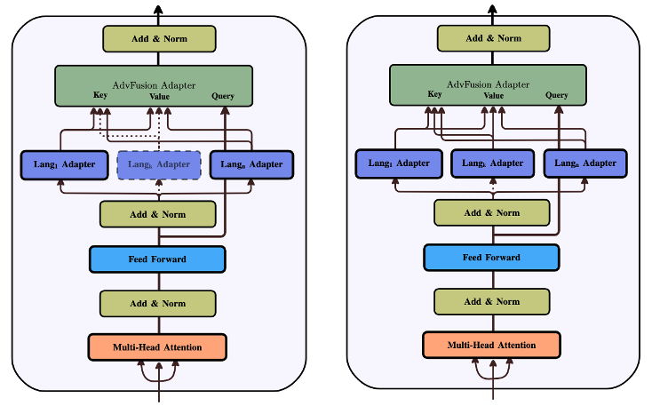

# Source code of AdvFusion:


This repository contains the implementation and results of ["AdvFusion: Adapter-based Knowledge Transfer for Code Summarization on Code Language Models"](https://arxiv.org/pdf/2307.07854), a novel Parameter Efficient Fine-Tuning (PEFT) approach designed to improve knowledge transfer across programming languages for software engineering tasks. The paper explores the potential of multilingual PEFT architectures to enhance performance in tasks such as code summarization and method name prediction.

## Overview



Programming languages can benefit from cross-lingual knowledge transfer, particularly when fine-tuning pre-trained Code Language Models (Code-LMs). While full fine-tuning has demonstrated success in such scenarios, PEFT methods have emerged as efficient alternatives. However, existing PEFT architectures like AdapterFusion primarily leverage knowledge from the same language as the target task, limiting their ability to fully utilize cross-lingual information.

To address this, we propose AdvFusion, which:

Learns from other programming languages first: AdvFusion focuses on extracting useful knowledge from multiple languages before fine-tuning on the target language.
Adapts cross-lingual insights to the target task: This two-step approach ensures better utilization of latent information from diverse programming languages.
Key Contributions
AdvFusion Architecture: A novel PEFT-based method that outperforms AdapterFusion and other PEFT techniques by enhancing cross-lingual knowledge transfer.
Comprehensive Evaluation: We evaluate AdvFusion on two downstream tasks—code summarization and method name prediction—using benchmark datasets.
Superior Performance:
Achieves up to 1.7-point improvement over AdapterFusion.
Outperforms LoRA with gains of 1.99 (Ruby), 1.26 (JavaScript), and 2.16 (Go) on benchmark datasets.

## Getting Started


### Prerequisites

Python 3.8+

Install dependencies:

```bash
pip install -r requirements.txt
```


You can find:

Adapter helper functions including AdvFusion in [adapter-utils.py](./CodeBERT/code2nl/adapter_utils.py).

Code summarization for GraphCodeBERT in [code2nl Folder](./GraphCodeBERT/code2nl).

Method name prediction for GraphCodeBERT in [method_name_prediction Folder](./GraphCodeBERT/code2nl).

Code summarization for CodeBERT in [code2nl Folder](./CodeBERT/code2nl).

Method name prediction for CodeBERT in [method_name_prediction Folder](./CodeBERT/code2nl).

## Attention Contribution Results

You can find the contribution of each language for different target languages in [RQ2_Results Folder](./RQ2_Results).

## Citation

If you find this work useful, please consider citing:

```sql
@article{saberi2023multilingual,
  title={Context-Augmented Code Generation Using Programming Knowledge Graphs},
  authors={Iman Saberi, Amirreza Esmaeili, Fatemeh Fard,Fuxiang Chen},
  year={2024}
}
```
